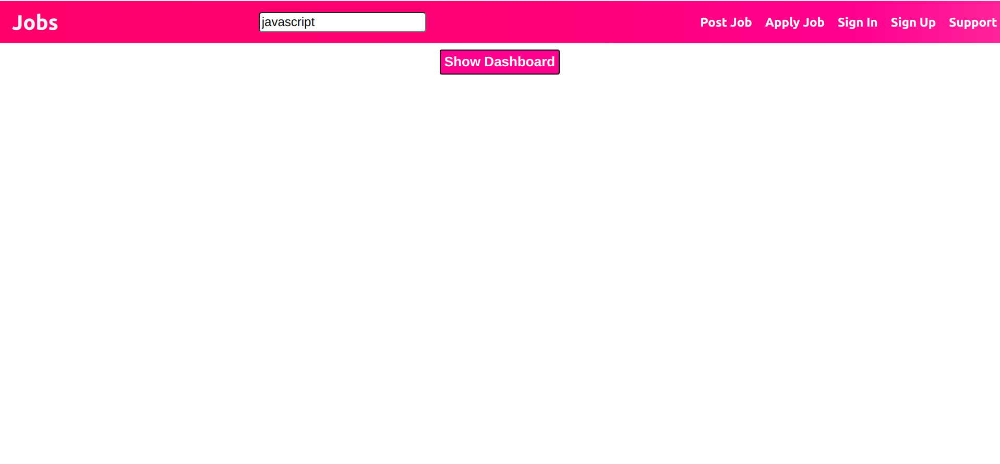
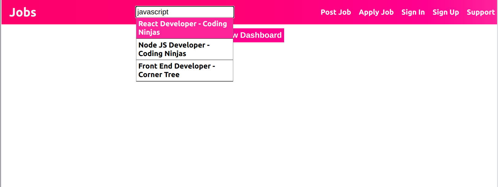
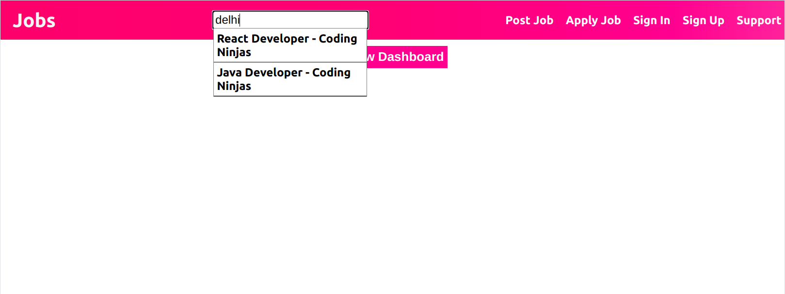
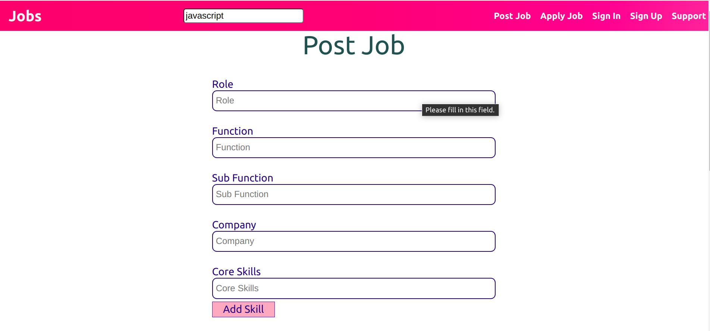
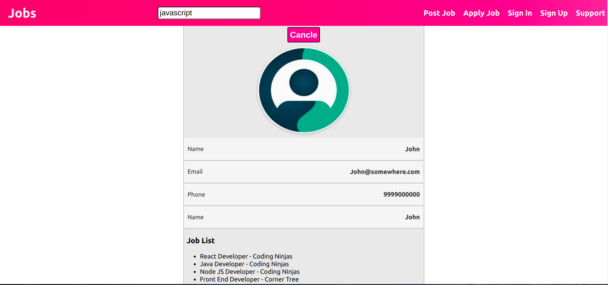

# Job Search

It is a react app for mananging jobs.

# Preview

Link :- https://corner-tree-assignment.web.app/

## Desktop View

### 1.Home



### 2. Search




### 3. Post Job



### 4. Dashboard



# Various Functionality

1. Searching a job based on location, pincode, skills.
2. Creating new job Post.
3. Dash Board.

# Techstack

### HTML, CSS, React, Node JS (API), Mongo DB

# API Detail :-

### API Repository Link :- https://github.com/dheerajk7/corner-tree-assignment-api.git

### API Hosted Link :- https://corner-tree-assignment.herokuapp.com/api/v1

# Instructions to install

1. Clone this repository from https://github.com/dheerajk7/corner-tree-react-app.git .
2. Install NPM if you have not installed yet.
3. Go to project directory and run these commands

   #### To install node Modules

   ```
   npm install
   ```

   #### To run project

   ```
   npm start
   ```

4. Go and check at http://localhost:3000

# Directory Structure

`/` - all react app files <br>
`/src` - all react app code files <br>
`/src/components`- all react component files <br>
`/src/styles` - all CSS style files <br>

---
